# Synlait Milk - Supply Chain Optimisation

## 📊 Project Overview
Supply chain optimization project focused on identifying operational inefficiencies and recommending solutions that reduce waste and support sustainability goals for Synlait Milk operations.

## 🎯 Objectives
- Map end-to-end supply chain processes
- Identify bottlenecks and waste points
- Develop actionable recommendations for efficiency improvements
- Align solutions with sustainability goals

## 🔍 Approach
- **Design Thinking Workshops**: Facilitated collaborative sessions with cross-functional stakeholders
- **Process Mapping**: Documented current-state workflows to identify pain points
- **Data Analysis**: Analyzed operational metrics including yield, downtime, and waste
- **Impact Prioritization**: Ranked improvements by feasibility and business impact

## 📈 Key Focus Areas
- Yield losses by production stage
- Equipment downtime frequency and duration
- Cold-chain compliance tracking
- Waste disposal and reuse opportunities
- Sustainability alignment

## 🖼️ Project Slides

<strong>View Presentation Slides (Click to expand)</strong>

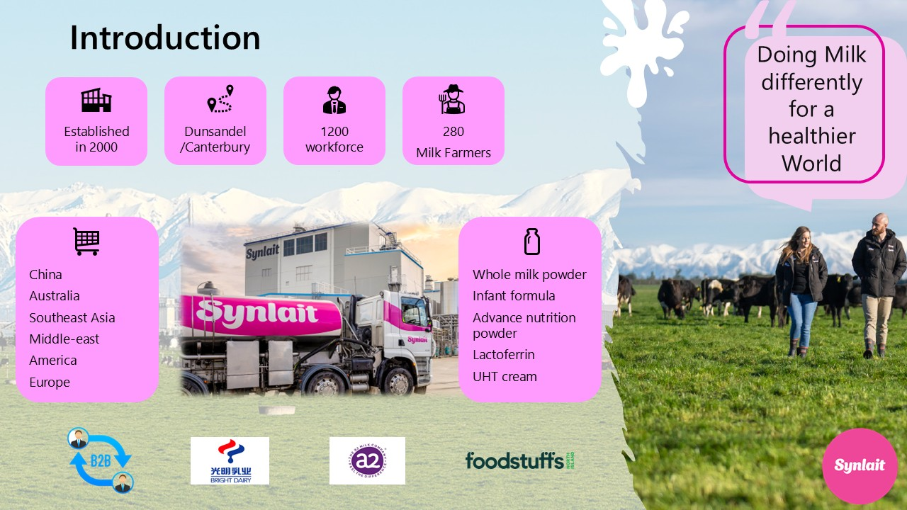
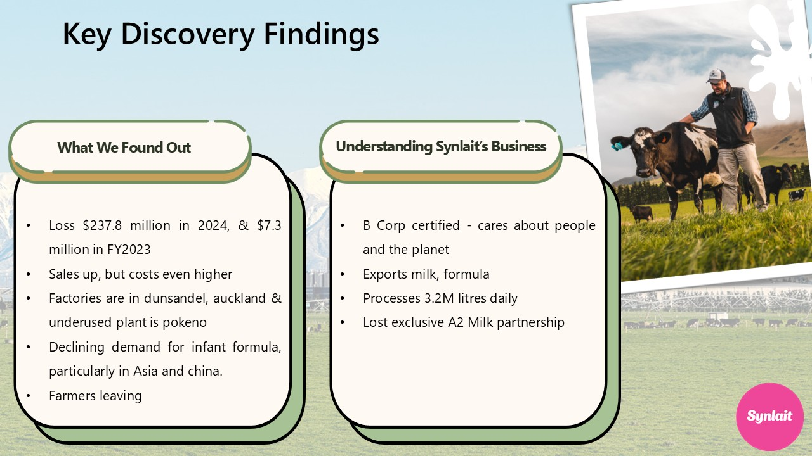
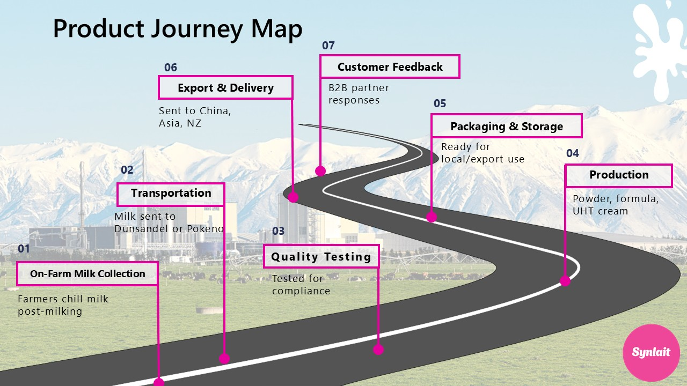
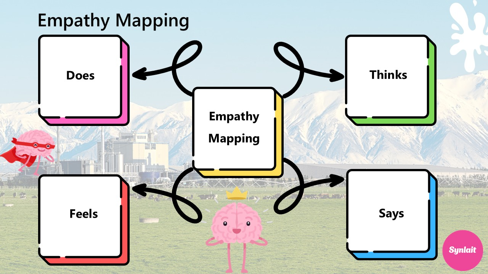
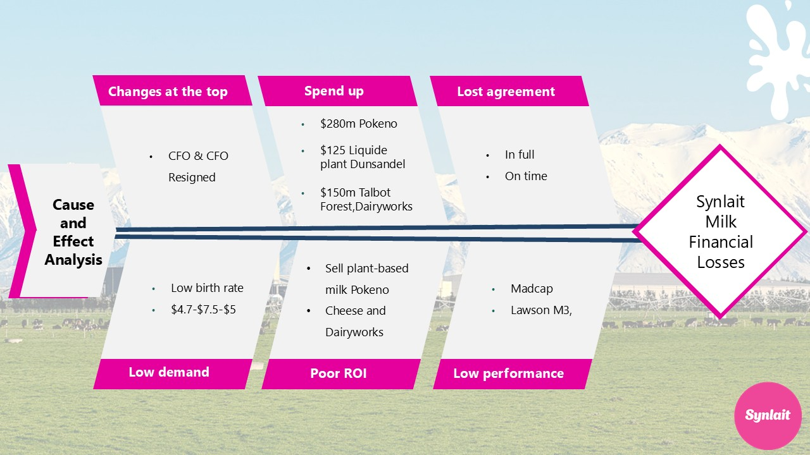
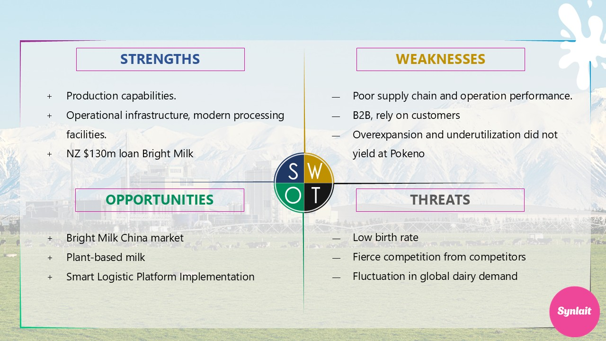
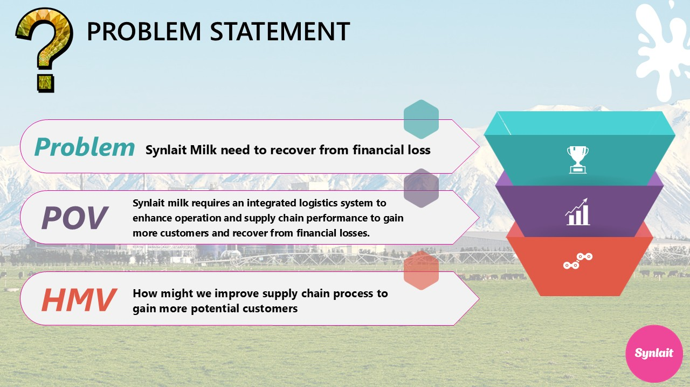
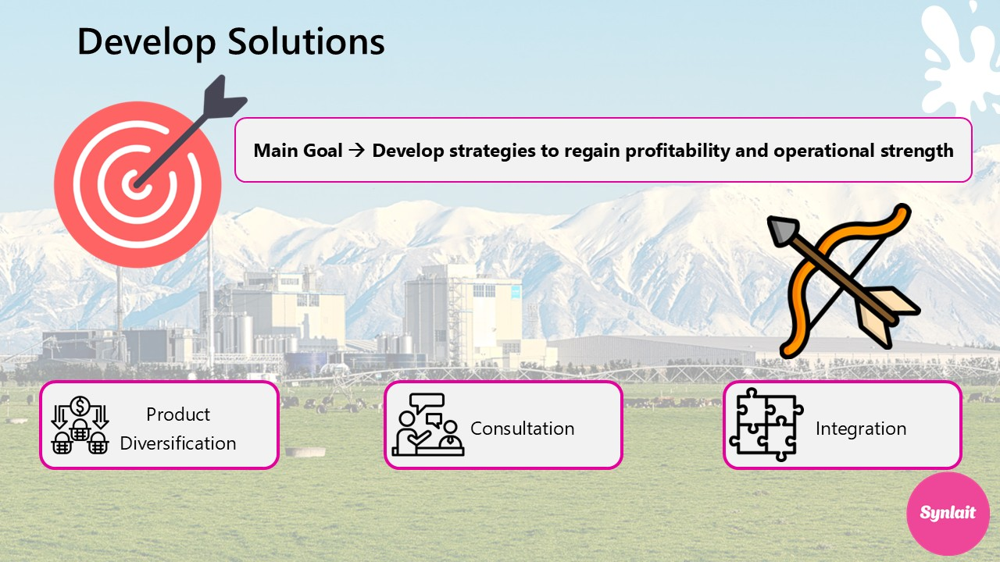
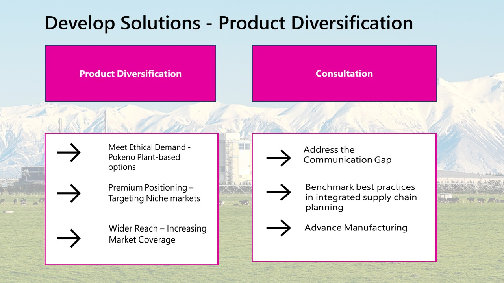
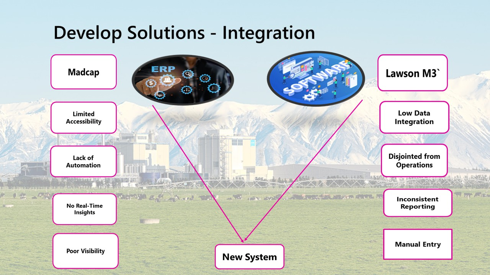
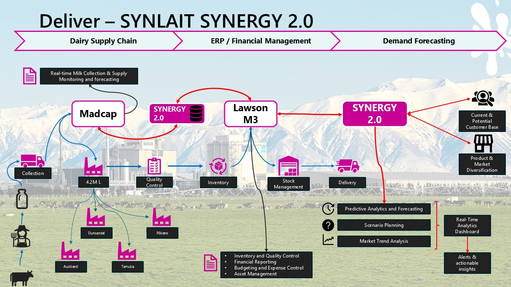
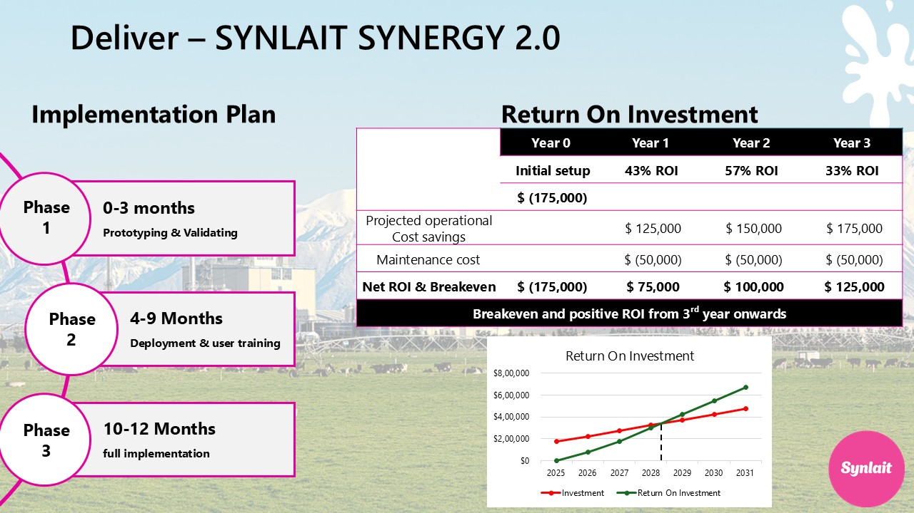
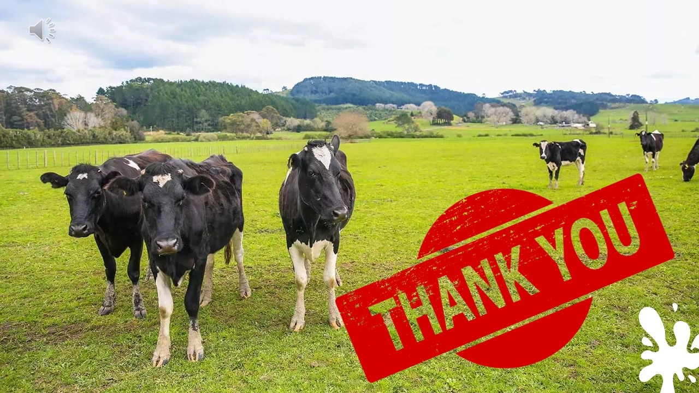

## 💡 Recommendations
- Implement real-time KPI dashboards for production monitoring
- Establish automated alerts for cold-chain deviations
- Create feedback loops between production and planning teams
- Develop waste tracking system with sustainability metrics

## 🛠️ Tools & Methods
- Design Thinking Framework
- Process Flow Mapping
- Stakeholder Analysis
- Data Visualization

## 📁 Data
Sample supply chain data is available in `data/supply_chain_sample.csv`
